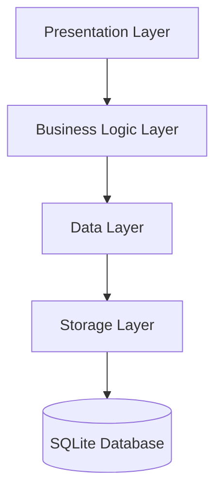

# Design Document

## Overview

The Attendance Tracker is a Flutter-based mobile application designed for educators to manage classes, students, and attendance records. The app will use a local SQLite database for data storage and will feature a clean, intuitive user interface with modern Flutter widgets. The design follows Material Design principles and supports both light and dark themes.

## Architecture

The application will follow a layered architecture pattern with clear separation of concerns:

1. **Presentation Layer**: UI components, screens, and widgets
2. **Business Logic Layer**: State management using Provider pattern
3. **Data Layer**: Repository pattern for data access and models
4. **Storage Layer**: SQLite database access using sqflite package



### State Management

The app will use the Provider package for state management, which offers:
- Efficient rebuilds of only the widgets that depend on changed state
- Simple dependency injection
- Testability
- Separation of UI and business logic

## Components and Interfaces

### Screens

1. **Home Screen (Class List)**
   - Displays list of classes
   - FAB for creating new class
   - Navigation to class details

2. **Class Detail Screen**
   - Displays class information and student list
   - FAB for adding new students
   - Buttons for taking attendance and viewing history
   - Options to edit/delete students

3. **Take Attendance Screen**
   - List of students with present/absent toggles
   - Date picker for selecting attendance date
   - Submit button to save attendance

4. **Attendance History Screen**
   - Calendar or date list view
   - Filtering options
   - Table/grid display of attendance records

5. **Edit Screens**
   - Forms for editing class details
   - Forms for editing student details
   - Interface for modifying past attendance records

### Key Components

1. **AppBar**: Consistent across screens with appropriate titles and actions
2. **BottomNavigationBar**: For main navigation between key features
3. **FloatingActionButton**: For primary actions on each screen
4. **ListView/GridView**: For displaying lists of classes, students, and attendance records
5. **Card & ListTile**: For displaying individual items in lists
6. **Dialog**: For confirmations and quick edits
7. **DatePicker**: For selecting dates for attendance
8. **Switch/Checkbox**: For marking attendance status

## Data Models

### Class Model
```dart
class Class {
  int id;
  String name;
  DateTime createdAt;
  DateTime updatedAt;
  
  // Computed properties
  int studentCount; // From related Student records
  int sessionCount; // From related AttendanceSession records
}
```

### Student Model
```dart
class Student {
  int id;
  int classId; // Foreign key to Class
  String name;
  String rollNumber; // Optional
  DateTime createdAt;
  DateTime updatedAt;
  
  // Computed properties
  double attendancePercentage; // Calculated from attendance records
}
```

### AttendanceSession Model
```dart
class AttendanceSession {
  int id;
  int classId; // Foreign key to Class
  DateTime date;
  DateTime createdAt;
  DateTime updatedAt;
}
```

### AttendanceRecord Model
```dart
class AttendanceRecord {
  int id;
  int sessionId; // Foreign key to AttendanceSession
  int studentId; // Foreign key to Student
  bool isPresent;
  DateTime createdAt;
  DateTime updatedAt;
}
```

## Database Schema

```mermaid
erDiagram
    CLASS {
        int id PK
        string name
        datetime created_at
        datetime updated_at
    }
    
    STUDENT {
        int id PK
        int class_id FK
        string name
        string roll_number
        datetime created_at
        datetime updated_at
    }
    
    ATTENDANCE_SESSION {
        int id PK
        int class_id FK
        datetime date
        datetime created_at
        datetime updated_at
    }
    
    ATTENDANCE_RECORD {
        int id PK
        int session_id FK
        int student_id FK
        boolean is_present
        datetime created_at
        datetime updated_at
    }
    
    CLASS ||--o{ STUDENT : "has"
    CLASS ||--o{ ATTENDANCE_SESSION : "has"
    ATTENDANCE_SESSION ||--o{ ATTENDANCE_RECORD : "contains"
    STUDENT ||--o{ ATTENDANCE_RECORD : "has"
```

## Service Classes

### DatabaseService
Responsible for:
- Database initialization
- Schema creation and migrations
- Basic CRUD operations

### ClassRepository
Responsible for:
- CRUD operations for classes
- Retrieving class statistics

### StudentRepository
Responsible for:
- CRUD operations for students
- Retrieving student attendance statistics

### AttendanceRepository
Responsible for:
- Creating attendance sessions
- Recording and updating attendance
- Retrieving and filtering attendance records

## Error Handling

1. **Database Errors**:
   - Wrap database operations in try-catch blocks
   - Provide user-friendly error messages
   - Log errors for debugging

2. **Input Validation**:
   - Validate all user inputs before saving
   - Provide immediate feedback for invalid inputs
   - Prevent submission of invalid forms

3. **State Management Errors**:
   - Handle edge cases in state transitions
   - Provide fallback UI for error states
   - Implement error boundaries where appropriate

## Testing Strategy

1. **Unit Tests**:
   - Test model classes and business logic
   - Test repository methods
   - Test utility functions

2. **Widget Tests**:
   - Test individual UI components
   - Test screen layouts and responsiveness
   - Test user interactions

3. **Integration Tests**:
   - Test database operations
   - Test end-to-end workflows
   - Test state management

## UI Design

### Color Scheme
- Primary: Material Blue (#2196F3)
- Secondary: Material Amber (#FFC107)
- Background (Light): White (#FFFFFF)
- Background (Dark): Dark Grey (#121212)
- Text (Light): Black (#000000)
- Text (Dark): White (#FFFFFF)

### Typography
- Use the default Flutter Material Design typography
- Headings: Roboto, bold, various sizes
- Body text: Roboto, regular, 14-16sp

### Layout Guidelines
- Consistent padding (16dp for most containers)
- Card elevation: 1-2dp
- Rounded corners: 8dp radius
- List item height: 56-72dp

### Navigation
- Bottom navigation for main sections
- Back button in app bar for nested screens
- Slide transitions between screens

## Accessibility Considerations

1. **Semantic Labels**: Add meaningful labels to all interactive elements
2. **Sufficient Contrast**: Ensure text has sufficient contrast against backgrounds
3. **Scalable Text**: Support system text scaling
4. **Touch Targets**: Ensure all touch targets are at least 48x48dp

## Performance Considerations

1. **Lazy Loading**: Implement pagination for long lists
2. **Caching**: Cache frequently accessed data
3. **Efficient Rebuilds**: Minimize widget rebuilds using Provider selectors
4. **Database Indexing**: Create appropriate indexes for frequent queries
5. **Batch Operations**: Use batch operations for multiple database changes