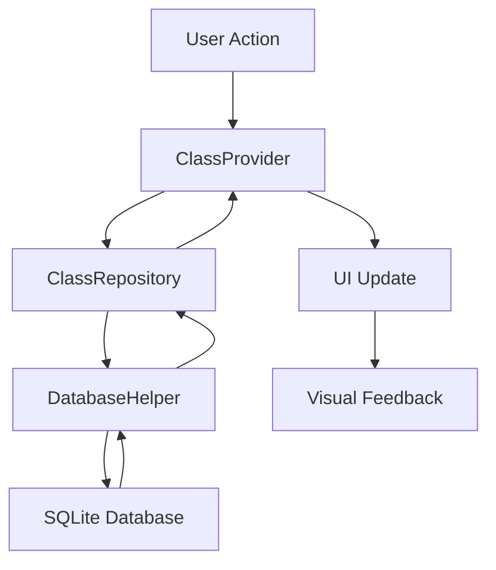

# Design Document

## Overview

The class pinning feature allows users to pin their most important classes to the top of the home screen list. This feature enhances user experience by providing quick access to frequently used classes while maintaining a clean and organized interface.

## Architecture

### Database Schema Changes

The existing `classes` table will be extended with a new column:

```sql
ALTER TABLE classes ADD COLUMN is_pinned INTEGER DEFAULT 0;
ALTER TABLE classes ADD COLUMN pin_order INTEGER DEFAULT NULL;
```

- `is_pinned`: Boolean flag (0/1) indicating if the class is pinned
- `pin_order`: Integer representing the order of pinned classes (lower values appear first)

### Data Flow



## Components and Interfaces

### 1. Model Updates

**Class Model Extension:**
```dart
class Class {
  // Existing fields...
  final bool isPinned;
  final int? pinOrder;
  
  // Updated constructor and methods
}
```

### 2. Repository Layer

**ClassRepository Updates:**
- `pinClass(int classId)`: Pin a class and assign pin order
- `unpinClass(int classId)`: Unpin a class and remove pin order
- `getAllClasses()`: Modified to return classes sorted by pin status and order

### 3. Provider Layer

**ClassProvider Updates:**
- `pinClass(int classId)`: Handle pin operation with state management
- `unpinClass(int classId)`: Handle unpin operation with state management
- `togglePinStatus(int classId)`: Toggle pin status
- Updated `loadClasses()` to handle pinned class sorting

### 4. UI Components

**ClassListItem Widget Updates:**
- Add pin indicator icon
- Add long-press gesture detection
- Add swipe actions for pin/unpin
- Visual styling for pinned classes

**New Components:**
- `PinContextMenu`: Context menu for pin/unpin actions
- `PinIndicator`: Visual indicator for pinned classes

### 5. Database Layer

**DatabaseHelper Updates:**
- `pinClass(int classId, int pinOrder)`: Database operation to pin class
- `unpinClass(int classId)`: Database operation to unpin class
- `getNextPinOrder()`: Get the next available pin order
- Updated `getClassesWithStats()` to include pin information and sorting

## Data Models

### Updated Class Model

```dart
class Class {
  final int? id;
  final String name;
  final DateTime createdAt;
  final DateTime updatedAt;
  final bool isPinned;
  final int? pinOrder;
  
  // Computed properties
  int? studentCount;
  int? sessionCount;
  
  // Updated methods
  Class copyWith({
    // existing parameters...
    bool? isPinned,
    int? pinOrder,
  });
  
  Map<String, dynamic> toMap();
  factory Class.fromMap(Map<String, dynamic> map);
}
```

### Pin Operation Result

```dart
class PinOperationResult {
  final bool success;
  final String? errorMessage;
  final Class? updatedClass;
  
  const PinOperationResult({
    required this.success,
    this.errorMessage,
    this.updatedClass,
  });
}
```

## Error Handling

### Database Errors
- Handle SQLite constraint violations
- Manage transaction rollbacks for pin order conflicts
- Provide fallback mechanisms for database failures

### UI Error States
- Display error messages for failed pin operations
- Maintain UI consistency during error states
- Provide retry mechanisms for failed operations

### Error Recovery
- Automatic retry for transient database errors
- Graceful degradation when pin functionality is unavailable
- Cache invalidation on error recovery

## Testing Strategy

### Unit Tests
- **Model Tests**: Verify Class model updates and serialization
- **Repository Tests**: Test pin/unpin database operations
- **Provider Tests**: Validate state management for pin operations
- **Database Tests**: Verify schema changes and query correctness

### Widget Tests
- **ClassListItem Tests**: Verify pin indicator display and interactions
- **Context Menu Tests**: Test pin/unpin menu functionality
- **Gesture Tests**: Validate long-press and swipe interactions
- **Animation Tests**: Ensure smooth visual transitions

### Integration Tests
- **Pin Workflow Tests**: End-to-end pin/unpin operations
- **Persistence Tests**: Verify pin state across app restarts
- **Sorting Tests**: Validate correct class ordering with pins
- **Performance Tests**: Ensure smooth scrolling with pinned classes

### Test Data Scenarios
- Empty class list
- All classes pinned
- Mixed pinned and unpinned classes
- Maximum pin limit scenarios
- Database migration scenarios

## Implementation Phases

### Phase 1: Database and Model Updates
- Extend Class model with pin properties
- Update database schema with migration
- Implement basic pin/unpin repository methods

### Phase 2: Provider and State Management
- Add pin operations to ClassProvider
- Implement sorting logic for pinned classes
- Add error handling and state management

### Phase 3: UI Components
- Update ClassListItem with pin indicator
- Implement long-press context menu
- Add swipe actions for pin operations

### Phase 4: Visual Enhancements
- Add animations for pin state changes
- Implement visual styling for pinned classes
- Add haptic feedback for interactions

### Phase 5: Testing and Polish
- Comprehensive testing suite
- Performance optimization
- Accessibility improvements
- Documentation updates

## Performance Considerations

### Database Optimization
- Index on `is_pinned` and `pin_order` columns
- Efficient sorting queries
- Minimal database operations for pin changes

### UI Performance
- Efficient list rendering with pinned items
- Smooth animations without blocking UI
- Optimized widget rebuilds

### Memory Management
- Proper disposal of animation controllers
- Efficient caching of pin states
- Minimal memory footprint for pin operations

## Accessibility

### Screen Reader Support
- Proper semantic labels for pin indicators
- Accessible context menu descriptions
- Clear announcements for pin state changes

### Keyboard Navigation
- Keyboard shortcuts for pin operations
- Focus management in context menus
- Accessible gesture alternatives

### Visual Accessibility
- High contrast pin indicators
- Sufficient color contrast for pinned items
- Support for reduced motion preferences

## Security Considerations

### Data Validation
- Validate pin order values
- Prevent SQL injection in pin operations
- Sanitize user input for pin-related operations

### State Consistency
- Atomic pin operations
- Consistent state across app lifecycle
- Proper error handling for concurrent operations