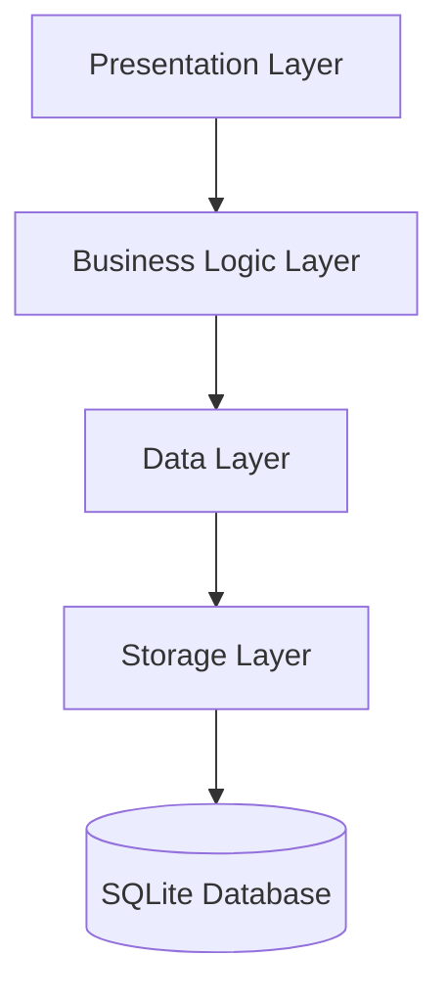

# Attendance Tracker Architecture

This document describes the architecture of the Attendance Tracker application.

## Overview

The Attendance Tracker app follows a layered architecture pattern with clear separation of concerns:

1. **Presentation Layer**: UI components, screens, and widgets
2. **Business Logic Layer**: State management using Provider pattern
3. **Data Layer**: Repository pattern for data access and models
4. **Storage Layer**: SQLite database access using sqflite package



## Layers

### Presentation Layer

The presentation layer is responsible for displaying the UI and handling user interactions. It consists of:

- **Screens**: Main UI screens like HomeScreen, ClassDetailScreen, etc.
- **Widgets**: Reusable UI components like ClassListItem, StudentListItem, etc.
- **Dialogs**: Modal dialogs for user input like AddClassDialog, AddStudentDialog, etc.

The presentation layer communicates with the business logic layer through the Provider pattern.

### Business Logic Layer

The business logic layer is responsible for managing the application state and business logic. It consists of:

- **Providers**: State management classes like ClassProvider, StudentProvider, etc.
- **Services**: Service classes like ServiceLocator, NavigationService, etc.

The business logic layer communicates with the data layer through repositories.

### Data Layer

The data layer is responsible for data access and manipulation. It consists of:

- **Repositories**: Data access classes like ClassRepository, StudentRepository, etc.
- **Models**: Data models like Class, Student, AttendanceSession, etc.

The data layer communicates with the storage layer through the DatabaseService.

### Storage Layer

The storage layer is responsible for data persistence. It consists of:

- **DatabaseService**: Handles database operations
- **DatabaseHelper**: Provides helper methods for complex queries

## Data Flow

1. User interacts with the UI (Presentation Layer)
2. UI calls methods on Providers (Business Logic Layer)
3. Providers call methods on Repositories (Data Layer)
4. Repositories call methods on DatabaseService (Storage Layer)
5. DatabaseService performs CRUD operations on the SQLite database
6. Results flow back up through the layers

## State Management

The app uses the Provider package for state management, which offers:

- Efficient rebuilds of only the widgets that depend on changed state
- Simple dependency injection
- Testability
- Separation of UI and business logic

## Database Schema

```mermaid
erDiagram
    CLASS {
        int id PK
        string name
        datetime created_at
        datetime updated_at
    }
    
    STUDENT {
        int id PK
        int class_id FK
        string name
        string roll_number
        datetime created_at
        datetime updated_at
    }
    
    ATTENDANCE_SESSION {
        int id PK
        int class_id FK
        datetime date
        datetime created_at
        datetime updated_at
    }
    
    ATTENDANCE_RECORD {
        int id PK
        int session_id FK
        int student_id FK
        boolean is_present
        datetime created_at
        datetime updated_at
    }
    
    CLASS ||--o{ STUDENT : "has"
    CLASS ||--o{ ATTENDANCE_SESSION : "has"
    ATTENDANCE_SESSION ||--o{ ATTENDANCE_RECORD : "contains"
    STUDENT ||--o{ ATTENDANCE_RECORD : "has"
```

## Error Handling

The app uses a centralized error handling approach:

1. **AppErrorHandler**: Global error handler for uncaught exceptions
2. **ErrorHandler**: Utility class for handling errors in a consistent way
3. **CustomSnackBar**: Widget for displaying error messages to the user

## Performance Optimization

The app includes several performance optimizations:

1. **Database Indexing**: Indexes on frequently queried columns
2. **Caching**: Caching of frequently accessed data
3. **Efficient List Rendering**: Use of RepaintBoundary and cacheExtent
4. **Performance Monitoring**: Utilities for measuring performance

## Responsive Design

The app is designed to work on different screen sizes and orientations:

1. **ResponsiveLayout**: Utility class for responsive layouts
2. **OrientationBuilder**: Adapts UI based on device orientation
3. **MediaQuery**: Adjusts font sizes based on screen width